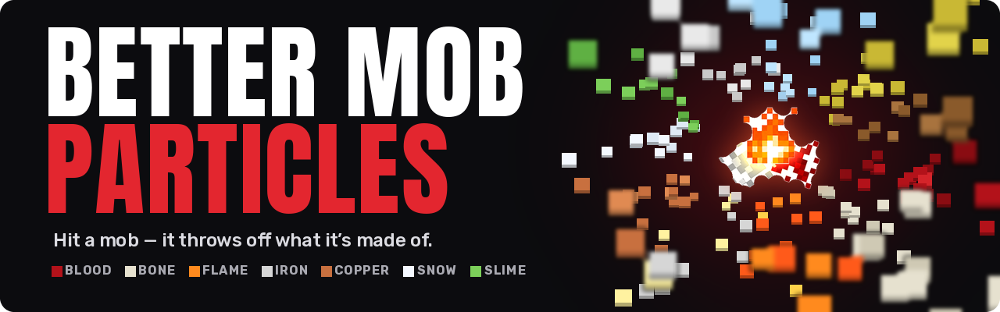

<p align="center">
  
</p>

<p align="center">
  <a href="https://modrinth.com/mod/better-mob-particles"></a>
  <a href="https://github.com/Mixaold/BetterMobParticles/issues"></a>
  <a href="https://www.donationalerts.com/r/mixaold"></a>
</p>

<p align="center">
  
  
  
  
</p>

<p align="center"><b>English</b> · <a href="#русский">Русский</a></p>

---

## About

Hit a mob in vanilla and it flashes red for a moment. That's the whole feedback you get.

This mod makes hits look like hits. Whatever you hit throws off the stuff it's made of — blood from
flesh, bone chips from skeletons, sparks from a blaze, ash from a ghast, a puff of air from a breeze.
Blood flies out of the wound in the direction of the hit, falls, lands on the ground and slowly fades
away.

Works with any weapon from any mod, plus plain vanilla arrows and your bare fists.

## What comes out of what

| Mob | What flies out |
|---|---|
| Everything else, players included | Red blood |
| Skeletons | Bone chips |
| Blaze, magma cube, wither | Flame and lava embers |
| Iron golem | Iron chips and sparks |
| Copper golem | Copper chips |
| Snow golem | Snowflakes |
| Slime | Slime |
| Ghast, happy ghast | White ash |
| Breeze | A puff of air, straight up |
| Sulfur cube | Sulfur |
| Creaking | Wood chips |
| Armor stand, ender dragon, vex, allay, shulker, enderman | Nothing |

## When it happens

- **Arrow, trident or any projectile** — always
- **Sword, axe, pickaxe, shovel, hoe, trident, mace** — always
- **Bare fist, a block, a torch** — sometimes, and less of it

Nothing comes out if the hit was blocked by a shield, or from fall damage, fire, drowning and poison —
there is no wound to bleed from.

## Settings

**Mod Menu → Better Mob Particles → Settings.** How many particles, how long blood lies on the ground,
how far it sprays, and whether melee hits count at all. Everything can be turned off.

## Install

Needs [Fabric API](https://modrinth.com/mod/fabric-api) and
[Cloth Config](https://modrinth.com/mod/cloth-config). [Mod Menu](https://modrinth.com/mod/modmenu)
is optional — it just adds the settings button.

> [!IMPORTANT]
> Put the jar on **both the client and the server**, same version on both sides. Different versions and
> the client gets kicked at login.

## Build

```
./gradlew build
```

The jar lands in `build/libs/`.

## License

[MIT](LICENSE).

---

<p align="center"><a href="#about">English</a> · <b>Русский</b></p>

## Русский

### О моде

Бьёшь моба в ванили — он на мгновение краснеет. Это вся обратная связь.

Мод делает так, что удар выглядит ударом. Из того, по кому ты попал, вылетает то, из чего он сделан:
кровь из плоти, костная крошка из скелета, искры из блейза, пепел из гаста, порыв воздуха из бриза.
Кровь вылетает из раны по направлению удара, падает, ложится на землю и медленно тает.

Работает с любым оружием из любого мода, а ещё с обычными стрелами и голыми кулаками.

### Из кого что летит

| Моб | Что вылетает |
|---|---|
| Все остальные, включая игроков | Красная кровь |
| Скелеты | Костная крошка |
| Блейз, лавовый куб, иссушитель | Пламя и угольки лавы |
| Железный голем | Крошка железа и искры |
| Медный голем | Крошка меди |
| Снежный голем | Снежинки |
| Слизень | Слизь |
| Гаст, дружелюбный гаст | Белый пепел |
| Бриз | Порыв воздуха, вверх |
| Серный куб | Сера |
| Скрипун | Древесная крошка |
| Стойка для брони, дракон Края, вредина, аллей, шалкер, эндермен | Ничего |

### Когда это происходит

- **Стрела, трезубец, любой снаряд** — всегда
- **Меч, топор, кирка, лопата, мотыга, трезубец, булава** — всегда
- **Кулак, блок, факел** — иногда и поменьше

Ничего не вылетает, если удар заблокировали щитом, а также от падения, огня, утопления и яда — там
нет раны.

### Настройки

**Mod Menu → Better Mob Particles → Настройки.** Сколько частиц, сколько кровь лежит на земле, как
далеко разлетается и считаются ли удары в ближнем бою. Всё можно выключить.

### Установка

Нужны [Fabric API](https://modrinth.com/mod/fabric-api) и
[Cloth Config](https://modrinth.com/mod/cloth-config). [Mod Menu](https://modrinth.com/mod/modmenu)
по желанию — он только добавляет кнопку настроек.

> [!IMPORTANT]
> Ставить jar **и на клиент, и на сервер**, одной и той же версии. Разные версии — и клиента выкинет
> на входе.

### Сборка

```
./gradlew build
```

Готовый jar появится в `build/libs/`.

### Лицензия

[MIT](LICENSE).
